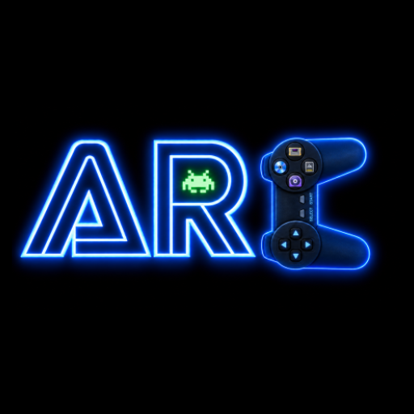

  

# Arc Emulator

An open-source Libretro emulator for Android focused on clean user experience, high compatibility, and deep customization.

**Arc Emulator** is a modern Android emulation platform powered by Libretro. Designed with a focus on simplicity and performance, it provides a seamless bridge between classic hardware and modern mobile devices.

> [!NOTE]
> **Pre-Release Beta:** Arc is currently in active development. Since the project is still in its early stages, expect some bugs. Your feedback is incredibly important as we continue to improve the experience.

---

## 📸 Visual Showcase

| Home Screen | Game View | Controller Mapping |
| :---: | :---: | :---: |
|  |  |  |

| Library Grid | Search View | App Settings |
| :---: | :---: | :---: |
|  |  |  |

---

## ✨ Key Features

*   **Modern Jetpack Compose UI:** A responsive interface with full Light/Dark theme options and customizable home branding.
*   **Physical Controller Support:** Full Bluetooth and USB gamepad compatibility with a dedicated button mapping tool and per-game profiles.
*   **Pro Touch Engine:** Individually resizable and transparent buttons, high-performance Canvas joysticks, and support for both Modern and Classic controller themes.
*   **Automated Box Art:** Background scraping for high-quality game covers via Libretro and ScreenScraper.
*   **Stable Navigation:** Persistent game state management and "Non-blocking" transitions for a snappy feel.
*   **Save States & Rewind:** Instant progress management with 5 visual slots and preview support.

---

## 🎨 Personalization & View Styles

Arc gives you control over how your collection is displayed:
*   **Library Styles:** Toggle between a **Detailed List** (with game info) and a **Poster Grid** (focused on box art).
*   **Grid Scaling:** Adjust the sizing of game cards on the Home and Library screens to fit more games on your screen.
*   **Show Extensions:** Toggle file extensions (`.sfc`, `.gba`) on or off for a cleaner library look.
*   **Adaptive Branding:** Choose between the "Retro Icon", "Modern Icon", or "App Name" styles for the main app header.

---

## 🎮 Supported Platforms

| Platform | Status | Preferred Libretro Core |
| :--- | :--- | :--- |
| **SNES** | ✅ Working | `snes9x_libretro_android` |
| **GBA / GB / GBC** | ✅ Working | `mgba_libretro_android` |
| **PS1** | ✅ Working | `pcsx_rearmed_libretro_android` |
| **N64** | ✅ Working | `mupen64plus_next_libretro_android` |
| **Genesis / Mega Drive** | ✅ Working | `genesis_plus_gx_libretro_android` |
| **GameCube** | ❌ Not Working (Planned) | `dolphin_libretro_android` |
| **Wii** | ❌ Not Working (Planned) | `dolphin_libretro_android` |

> [!NOTE]
> **Active Development:** Platform support and Libretro core integrations are actively expanding. Additional cores and optimizations are planned for future updates.

### Core Downloads & Import
If a core is not bundled, you can download them from the [Libretro Nightly Builds](https://buildbot.libretro.com/nightly/android/latest/).
*   **Mobile & Tablet Users:** Look for the **arm64-v8a** version for optimal performance.
*   **Import via App:** Use the **Setup Guide** or navigate to **Settings > System > Import Cores** to select and install your `.so` core files.
*   **Manual Install:** Alternatively, place the `.so` files into your `Documents/Arc/cores/` directory and use the **Rescan Cores** button in the app.

---

## 🚀 Getting Started

### 1. Installation
Download the latest `Arc-Emulator-vX.X.X.apk` from the [Releases](../../releases) page and install it on your Android device.

### 2. Initial Setup
Upon first launch, the **Guided Setup** will walk you through:
*   Configuring access to your game folders.
*   Scanning your collection to build your library.
*   Checking for necessary BIOS files for systems like PS1.

### 3. Folder Structure
Arc organizes your data in a visible folder in your **Documents** directory:
*   **`Documents/Arc/system/`**: Place your BIOS files here (e.g., `scph5501.bin`).
*   **`Documents/Arc/saves/`**: Your game saves and state files.
*   **`Documents/Arc/templates/`**: Your custom touch layout templates.
*   **`Documents/Arc/cores/`**: Manually add extra `.so` cores here if they aren't bundled.

---

## 🕹️ Advanced Customization

### Touch Layout Templates
Don't want to re-align your buttons for every game?
1.  Enter **Edit Mode** during gameplay.
2.  Arrange your buttons, then select **Save as Template** from the menu.
3.  In any other game, select **Apply Template** to instantly load your favorite layout.

### Per-Button Precision
Every button in Arc is independent. In Edit Mode, tap a button to adjust its **Scale** (for larger fingers) and **Alpha** (for a cleaner view) using precise sliders.

---

## 🛠️ Troubleshooting & Tips

### Missing BIOS Files
Systems like PS1 and GBA perform best with original BIOS files. Use the **BIOS Manager** in Settings to check your status; it will show a ✅ if the file is correctly placed in `/Documents/Arc/system/`.

### Controller Stick Drift
If your physical controller has stick drift, navigate to **Settings > Input Device > Analog Deadzone** and adjust the slider to increase the "null zone" of your thumbsticks.

### Black Screen on Resume
If the game screen remains black after returning from a menu:
1.  Open the **In-Game Menu** and select **Resume**.
2.  If the picture still doesn't appear, select **Reset Game**.
3.  If the issue persists, restart the app and load the game again.
*If you consistently encounter this, please report it! Sharing details about the core and ROM helps us improve the engine.*

---

## 💎 Support the Project

If you enjoy using Arc Emulator and want to support its development, consider buying me a coffee! Your support helps me dedicate more time to adding new features and improving the app.

---

## 🤝 Community & Feedback

Found a bug or have a feature request?
*   **Issues:** Report them on the [GitHub Issues](../../issues) page.
*   **Feedback:** We truly value your feedback to help improve Arc.
*   **Bug Reports:** If a game crashes, please include details about your device, the emulator core, and the ROM type. The **Diagnostics** tool in the **About** screen provides internal state information that is very helpful for troubleshooting.

---

## 📜 License

Copyright (C) 2026 Blink-Chase. Licensed under the [GNU General Public License v3.0](LICENSE).
